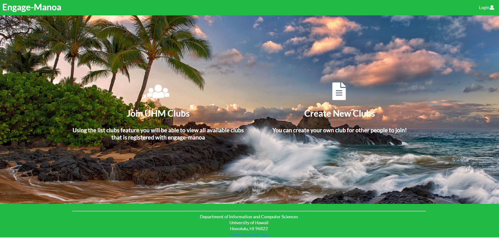
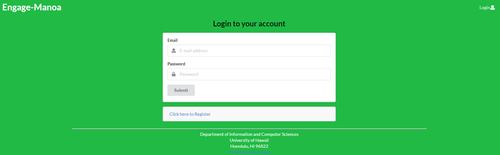
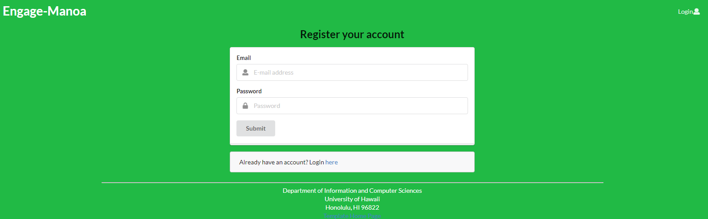
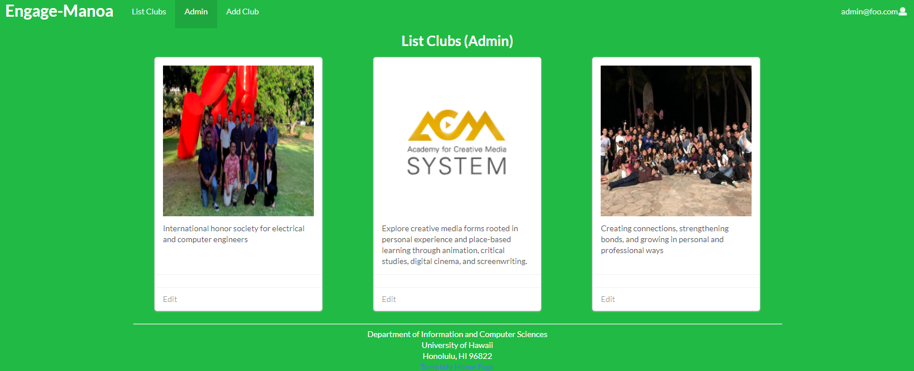
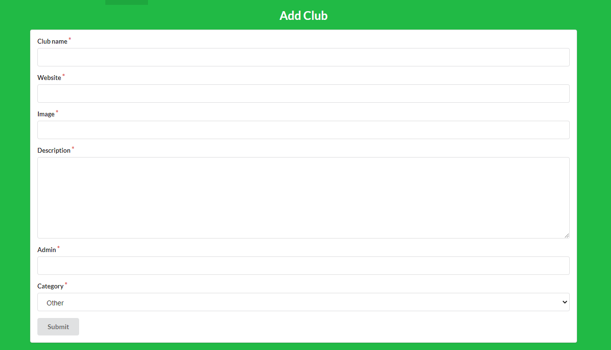
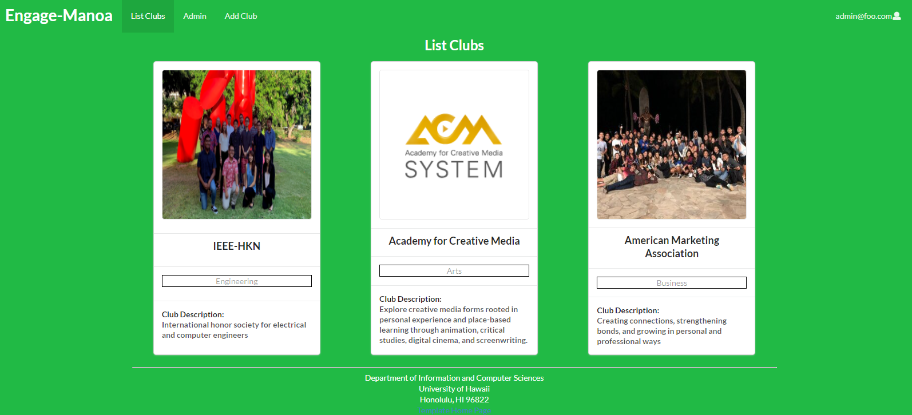
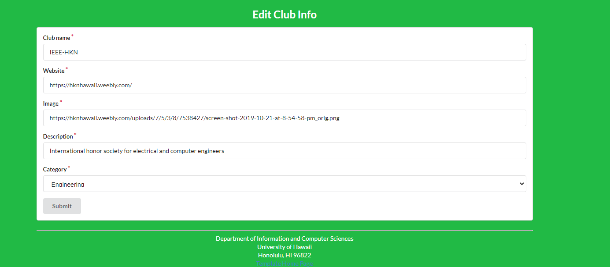

aesthetics# Engage-manoa
## Table of contents
- [Overview](#overview)
- [Site](#site-overview)
- [Development](#development)
- [Team Members](#team-members)

## Overview
The Engage Manoa website is a centralized directory open to UH Manoa students looking for organizations/clubs. Engage Manoa will be designed to offer an easily accessible online space for students to find up-to-date information regarding all campus organizations and clubs. Users can create a profile and have access to a full directory to find a club or organization based on their interests.

The website uses
- Meteor - for server and client code
- React - for UI implementation
- Semantic UI - CSS Framework
-Digital Ocean - for hosting and deployment

### [Engage Manoa site](http://134.209.77.173/#/)
### [Engage-Manoa repo](https://github.com/engage-manoa/engage-manoa)

## Site Overview

### [Landing Page](http://134.209.77.173/#/)
The landing page gives an overview of the site. Eventually it will be updated to show example clubs and uses.

### [Login Page](http://134.209.77.173/#/signin/)

### [Sign-up Page](http://134.209.77.173/#/signup)

### [Admin Page](http://134.209.77.173/#/admin)
If you're signed in with an admin account you have access to the Admin Page. The Admin page displays all the clubs in the system and gives you edit access to all of them.

### [Add Club Page](http://134.209.77.173/#/addclub)
If you're signed in with an admin account you have access to the Add Club Page. This page allows you to add clubs to the system. Currently this is the only way for clubs to be added.

### [List Clubs Page](http://134.209.77.173/#/listclubs)
The list clubs page displays all the clubs in the system. In the next iteration a search system will be implemented to allow users to easily find clubs they are interested in.

### Edit Club Info
A button to take you to the Edit Club Info page appears at the bottom of the card if you are listed as the manager of a club or are on the Admin Page. From this page you are able to edit the clubs saved info.

## Development
### [Milestone 1](https://github.com/engage-manoa/engage-manoa/projects/1)
The focus of the first milestone was to establish the main structure of the site.
We decided to put off working on aesthetics until we have completed the main core functionality of the site.

### [Milestone 2](https://github.com/engage-manoa/engage-manoa/projects/2)
Milestone 2 will focus on expanding the features of the site.

### Milestone 3
For milestone 3 will focus on the aesthetics of the site as well as any additional extra features for the users.

## Team Members
### [Jun Ho](https://junhocs.github.io)
### [Mikel](https://mikel-ishihara.github.io/)
### [Christian](https://www.notion.so/Christian-Pak-Portfolio-2020-554fded38ce9497198e62aaeca8b3b52)
### [Sreelakshmi](https://smkutty.github.io/)
