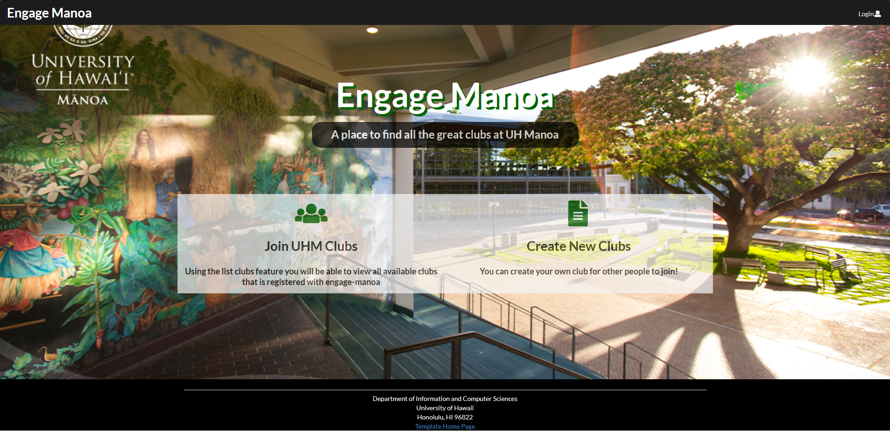
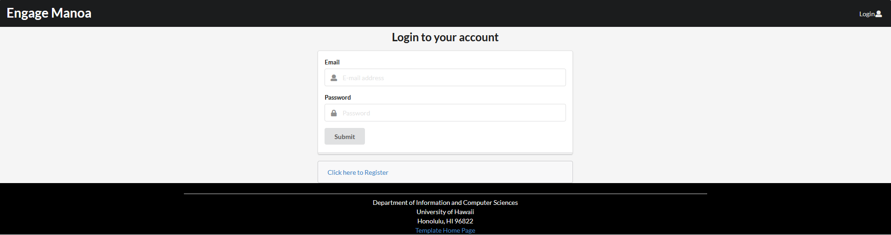
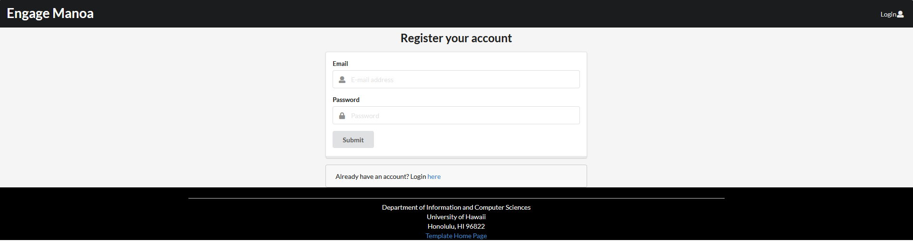
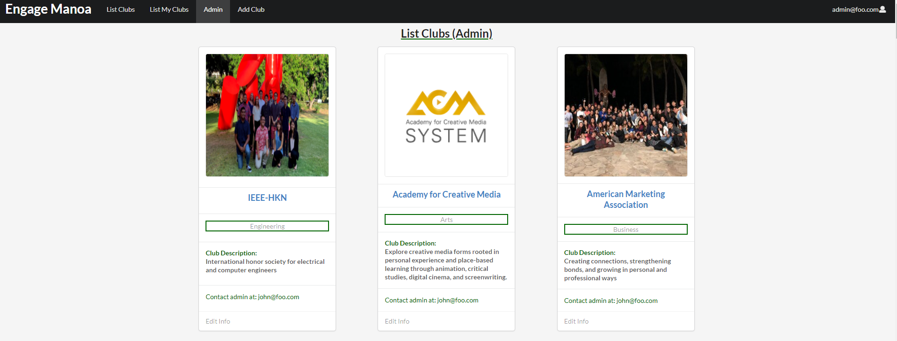
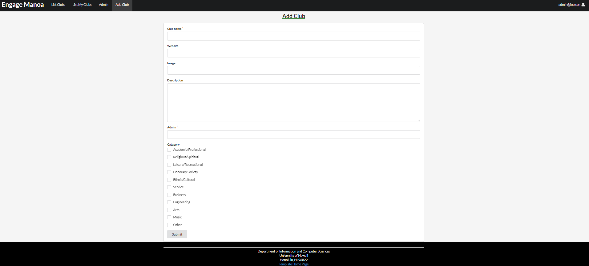
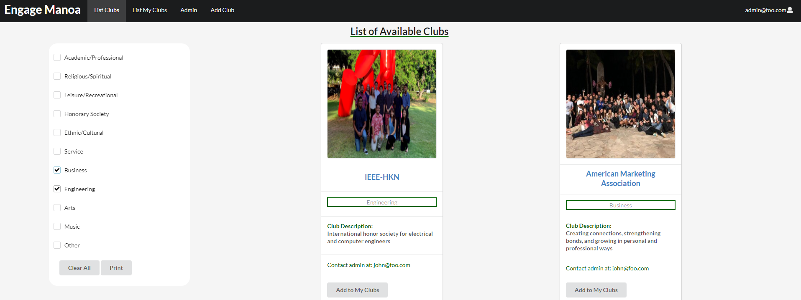

## Table of contents
- [Overview](#overview)
- [Deployment](#Deployment)
- [User Guide](#user-guide)
- [Development](#development)
- [Community Feedback](#community-feedback)
- [Developer Guide](#developer-guide)
- [Team Members](#team-members)

## Overview
The Engage Manoa website is a centralized directory open to UH Manoa students looking for organizations and clubs. UH Manoa is home to many clubs and student organizations. but there isn't currently a way to browse the different clubs digitally. The only option is the google spreadsheet which lists all of UH Manoa's registered independent organizations. Engage Manoa will be designed to offer an easily accessible online space for students to find up-to-date information regarding all campus organizations and clubs. Users can create a profile and have access to a full directory to find a club or organization based on their interests.

The website uses
- Meteor - for server and client code
- React - for UI implementation
- Semantic UI - CSS Framework
- Digital Ocean - for hosting and deployment

## Deployment
A live deployment of the Engage Manoa site is available at: [Engage Manoa](http://engage-manoa.xyz/#/)

Link to Engage manoa Repo: [Engage-Manoa repo](https://github.com/engage-manoa/engage-manoa)

## User Guide

### [Landing Page](http://engage-manoa.xyz/#/)
The landing page gives an overview of the site. Eventually it will be updated to show example clubs and uses.


### [Login Page](http://engage-manoa.xyz/#/signin/)


### [Sign-up Page](http://engage-manoa.xyz/#/signup)


### You must be logged in to view the following pages

### [Admin Page](http://engage-manoa.xyz3/#/admin)
If you're signed in with an admin account you have access to the Admin Page. The Admin page displays all the clubs in the system and gives you edit access to all of them.


#### Club Admins
If you are listed as the contact person on UH's RIO [spreadsheet](https://docs.google.com/spreadsheets/d/1vK_ixq3a86uXjHXy9oNnyYHwAvyU9smNPKuJU6OYd-Q/edit#gid=94293836) then your email has been automatically registered as that club's Admin. You must create an account using the email listed on the spreadsheet to be able to change your club's listing. Please find your club then hit edit club info and add a photo and a description about your club for other users to see.

### Edit Club Info
A button to take you to the Edit Club Info page appears at the bottom of a club's card if you are listed as the manager of a club or are on the Admin Page. From this page you are able to edit the clubs saved info.

### [Add Club Page](http://engage-manoa.xyz/#/addclub)
If you're signed in with an admin account you have access to the Add Club Page. This page allows you to add clubs to the system. Clubs are also can be added through a [CSV file](#Loading-the-default-data).


### [List Clubs Page](http://engage-manoa.xyz/#/listclubs)
The list clubs page displays all the clubs in the system. You can check which club categories you want to view on the left to filter which clubs are listed.



## Development
### [Milestone 1](https://github.com/engage-manoa/engage-manoa/projects/1)
The focus of the first milestone was to establish the main structure of the site.
We decided to put off working on aesthetics until we have completed the main core functionality of the site.

### [Milestone 2](https://github.com/engage-manoa/engage-manoa/projects/2)
Milestone 2 focused on expanding the features of the site. Specifically the club search functionality and adding clubs to your my club page.

### [Milestone 3](https://github.com/engage-manoa/engage-manoa/projects/3)
Milestone 3 focused on updating the UI of the site as well as polishing a few features based on feedback.

## Community Feedback
We gathered some feedback on the site from multiple members of the UH Manoa student body. We asked questions focusing on the: usability, UI, usefulness, and ways to improve the site. From there, we used the feedback to made changes to the UI and overall application. Most of the complaints for UI was directed towards many of the clubs missing bits of data. This shouldn't be a problem as the site is designed so the club admin maintains their own clubs info (so most entries on the prototype are missing photos' and descriptions).

The general consensus was the site was intuitive and was easy to understand (scored 4.6/5 on average for user friendliness). All of the participants thought that it would help them find clubs they would be interested in.

[Link to Feedback Form](https://forms.gle/8MgMzdpE1cUefYT96)

## Developer Guide
### Installation
First, click the "Clone or download" button to download the GitHup rep to your local file system.

Second, [install Meteor](https://www.meteor.com/install).

Next, cd into the app/ directory of your local copy of the repo, and install third party libraries with:

```
$ meteor npm install
```
### Viewing the app

Once the libraries are installed, you can run the application by invoking the "start" script in the [package.json file](https://github.com/engage-manoa/engage-manoa/blob/main/app/package.json):

```
$ meteor npm run start
```
The first time you run the app, it will create some default data. Once everything is running, your command prompt should display:

```
=> Started your app.

=> App running at: http://localhost:3000/
   Type Control-C twice to stop.
```
The running application will appear in your web browser at [http://localhost:3000](http://localhost:3000). You can either login using the credentials in [settings.development.json](https://github.com/engage-manoa/engage-manoa/blob/main/config/settings.development.json) under "defaultAccounts", or you can sign up and create your own account in the app.

### Loading the default data

There is default data that is stored in JSON format in [settings.development.json](https://github.com/engage-manoa/engage-manoa/blob/main/config/settings.development.json) under "defaultClubs". This data is loaded into the database upon startup. Additionally, you can load data from a CSV file that is stored as [rio.csv](https://github.com/engage-manoa/engage-manoa/blob/main/app/private/rio.csv). Note that the headers of this CSV file must be: clubName, category, Contact person, Admin, test.
The CSV used for the defaultClubs was from the [UH Mānoa Approved RIOs](https://docs.google.com/spreadsheets/d/1vK_ixq3a86uXjHXy9oNnyYHwAvyU9smNPKuJU6OYd-Q/edit#gid=94293836) entry for 2020-2021.

## Team Members
### [Jun Ho](https://junhocs.github.io)
### [Mikel](https://mikel-ishihara.github.io/)
### [Christian](https://www.notion.so/Christian-Pak-Portfolio-2020-554fded38ce9497198e62aaeca8b3b52)
### [Sreelakshmi](https://smkutty.github.io/)
