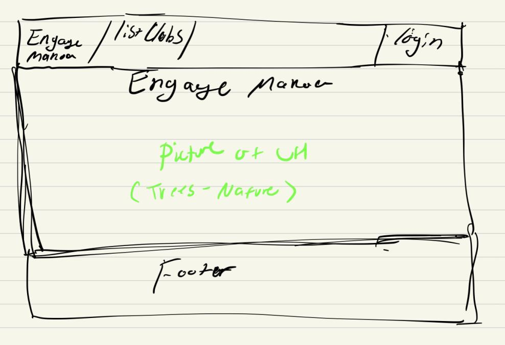
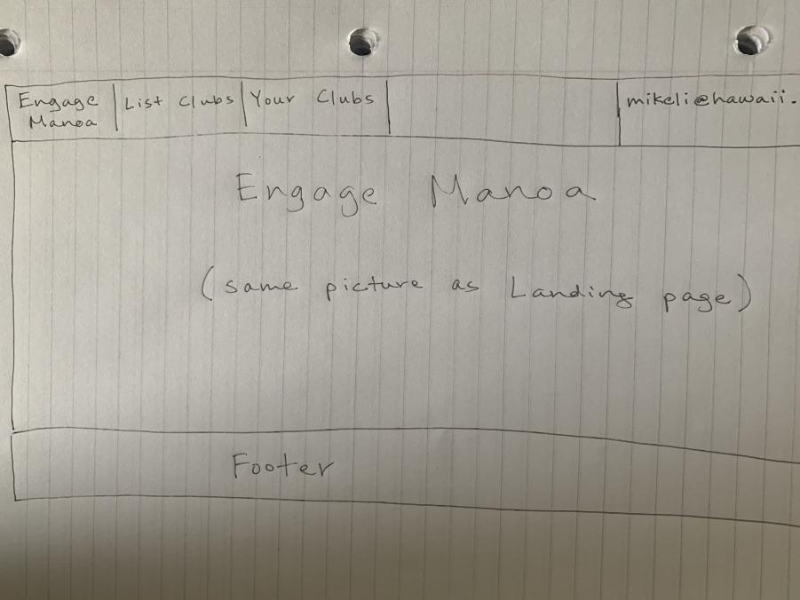

# Engage-manoa
[To engage-manoa repo](https://github.com/engage-manoa/engage-manoa)
## Table of contents
- [Overview](#overview)
- [Goals](#goals)
- [Team Members](#team-members)

## Overview

Engage-manoa will be a centralized directory open to UH Manoa students looking for organizations/clubs. it will use

- Meteor - for server and client code
- React - for UI implementation
- Semantic UI - CSS Framework

## Goals
Engage Manoa will be designed to offer an easily accessible online space for students to find up-to-date information regarding all campus organizations and clubs. Users can create a profile and have access to a full directory to find a club or organization based on their interests. 

## Team Members
### [Jun Ho](https://junhocs.github.io)
### [Mikel](https://mikel-ishihara.github.io/)
### [Christian](https://www.notion.so/Christian-Pak-Portfolio-2020-554fded38ce9497198e62aaeca8b3b52)
### [Sreelakshmi](https://smkutty.github.io/)

## Page Mockups

Landing page while user is not logged in

Landing page while user is logged in

List clubs page
